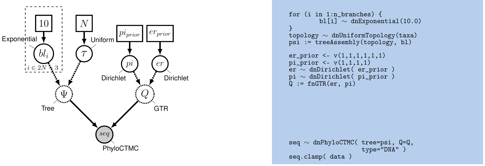
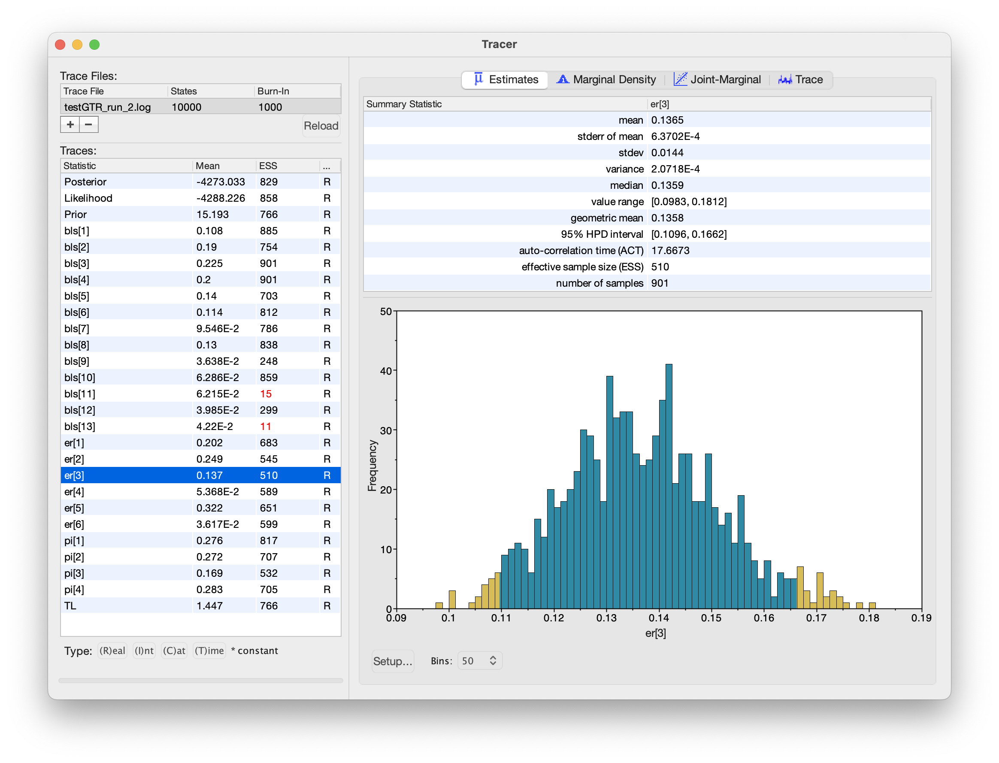
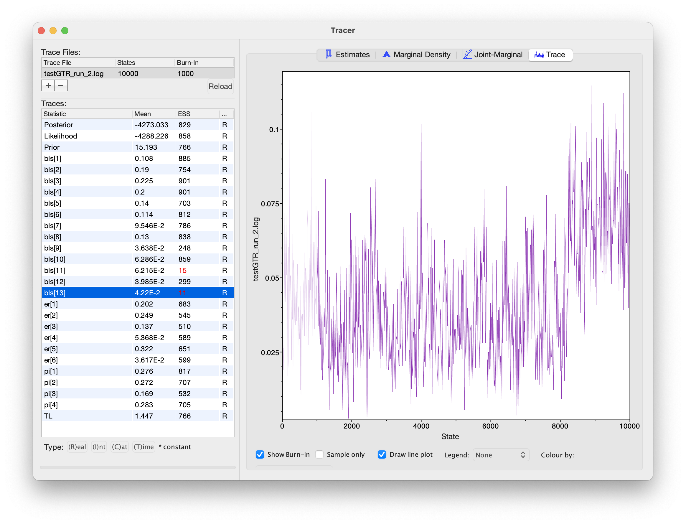
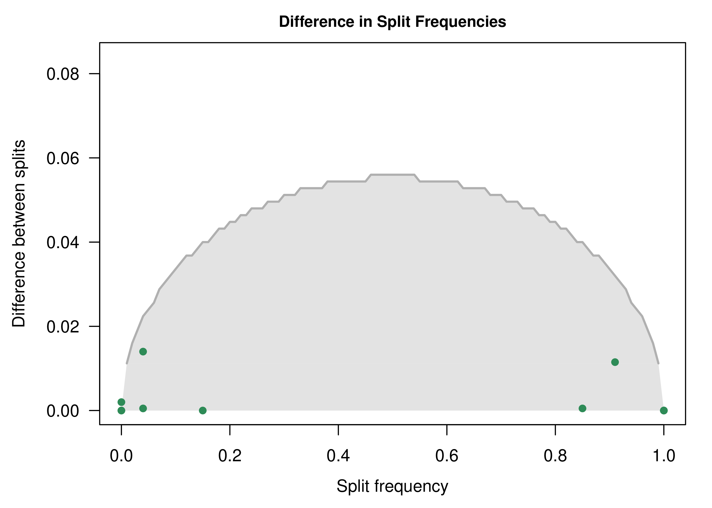
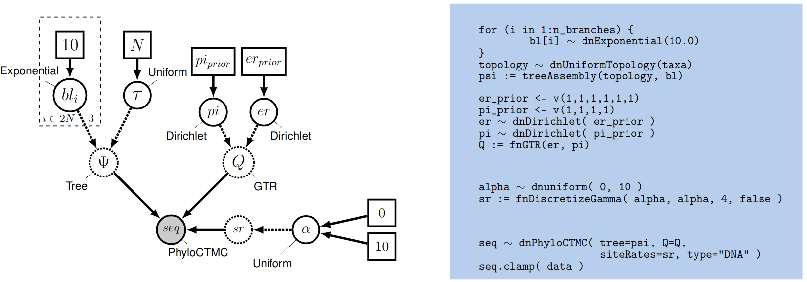
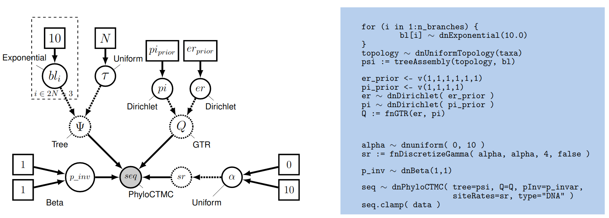

In this tutorial, we will perform phylogenetic analysis using the GTR model of nucleotide substitution, accounting for rate heterogeneity across sites.

A model of nucleotide substitution specifies the rates of substitution between all pairs of nucleotides. It is entirely defined by a 4x4 matrix called instantaneous rate matrix, or more simply, rate matrix ($Q$).



The most general time reversible model can be parameterized as follows:
$$Q = \begin{pmatrix}
{*} & \rho_{AC} \pi_C & \rho_{AG} \pi_G & \rho_{AT} \pi_T \\
\rho_{CA} \pi_A & {*}  & \rho_{CG} \pi_G & \rho_{CT} \pi_T \\
\rho_{GA} \pi_A & \rho_{GC}  \pi_C & {*}  & \rho_{GT} \pi_T \\
\rho_{TA} \pi_A & \rho_{TC} \pi_C & \rho_{TG} \pi_G & {*}
\end{pmatrix} \mbox{  ,}$$
with the constraint that $\rho_{XY} = \rho_{YX}$ for all nucleotide pairs $(X,Y)$. The $\rho$'s are called the relative exchangeabilities (or exchange rates), and the $\pi$'s are the equilibrium frequencies of the process. With the constraint of symmetry for $\rho$, we have 6 distinct values (6 unordered pairs of nucleotides). In addition, and without loss of generality, we can constrain the $\rho$ vector to sum to 1. With these constraints, $\rho$ is a 6-dimensional frequency vector (i.e. it is a point on the simplex $S6$).





Graphical model representation of the general-time reversible (GTR) phylogenetic model.




We want to use a uniform prior over $er$, so we use a Dirichlet distribution with equal weights.
We first define a constant node specifying the vector of
concentration-parameter values using the `v()` function:

```
er_prior <- v(1,1,1,1,1,1)
```


This node defines the concentration-parameter values of the Dirichlet
prior distribution on the exchangeability rates. Now, we can create a
stochastic node for the exchangeability rates themselves using the `dnDirichlet()`
function, which takes the vector of concentration-parameter values as an
argument and the `~` operator. Together, these create a stochastic node
named `er` ($\theta$ in ):

```
er ~ dnDirichlet(er_prior)
```

The Dirichlet distribution assigns probability densities to a [*simplex*](http://en.wikipedia.org/wiki/Simplex), a vector of values between 0 and 1.0 that must sum to 1. Simplices thus describe vectors of proportions. Here, we have specified a six-parameter Dirichlet prior, where each value describes one of the six relative rates of the GTR model: (1) $A\leftrightarrows C$; (2) $A\leftrightarrows G$; (3) $A\leftrightarrows T$; (4) $C\leftrightarrows G$; (5) $C\leftrightarrows T$; (6) $G\leftrightarrows T$. The input parameters of a Dirichlet distribution are called shape (or concentration) parameters. The expectation and variance for each variable are related to the sum of the shape parameters. The prior we specified above is a ‘flat’ or symmetric Dirichlet distribution; all of the shape parameters are equal (1,1,1,1,1,1). This describes a model that allows for equal rates of change between nucleotides, such that the expected rate for each is equal to $\frac{1}{6}$ (a).

We might also parameterize the Dirichlet distribution such that all of the shape parameters were equal to 100, which would also specify a prior with an expectation of equal exchangeability rates (b). However, by increasing the values of the shape parameters, `er_prior <- v(100,100,100,100,100,100)`, the Dirichlet distribution will more strongly favor equal exchangeability rates; (*i.e.*, a relatively informative prior).

Alternatively, we might consider an asymmetric Dirichlet parameterization that could reflect a strong prior belief that transition and transversion substitutions occur at different rates. For example, we might specify the prior density `er_prior <- v(4,8,4,4,8,4)`. Under this model, the expected rate for transversions would be $\frac{4}{32}$ and that for transitions would be $\frac{8}{32}$, and there would be greater prior probability on sets of GTR rates that match this configuration (c).

Yet another asymmetric prior could specify that each of the six GTR rates had a different value conforming to a Dirichlet(2,4,6,8,10,12). This would lead to a different prior probability density for each rate parameter (d). Without strong prior knowledge about the pattern of relative rates, however, we can better reflect our uncertainty by using a vague prior on the GTR rates. Notably, all patterns of relative rates have the same probability density under `er_prior <- v(1,1,1,1,1,1)`.




Four different examples of Dirichlet priors on exchangeability rates.



For each stochastic node in our model, we must also specify a proposal mechanism if we wish to sample values for that parameter.

```
moves.append( mvBetaSimplex(er, weight=3) )
moves.append( mvDirichletSimplex(er, weight=1) )
```

We can use the same type of distribution as a prior on the 4 stationary
frequencies ($\pi_A, \pi_C, \pi_G, \pi_T$) since these parameters also
represent proportions. We specify a flat Dirichlet prior density on the
base frequencies:

```
pi_prior <- v(1,1,1,1)
pi ~ dnDirichlet(pi_prior)
```

The node `pi` represents the $\pi$ node in . Now we add the simplex scale move on the stationary frequencies to the moves vector:

```
moves.append( mvBetaSimplex(pi, weight=2) )
moves.append( mvDirichletSimplex(pi, weight=1) )
```

We can finish setting up this part of the model by creating a deterministic node for the GTR instantaneous-rate matrix `Q`. The `fnGTR()` function takes a set of exchangeability rates and a set of base frequencies to compute the instantaneous-rate matrix used when calculating the likelihood of our model.

```
Q := fnGTR(er,pi)
```



Now we need to check whether our MCMC converged and mixed sufficiently to produce an adequate approximation of the joint posterior distribution of our model.
The first thing we usually do is assess behavior for continuous model parameters using `Tracer`.
To do this, we launch `Tracer` and load our `.log` file.
The bottom-left panel lists all the parameters in the log file (as well as the (unnormalized) posterior, likelihood and prior at each step of the chain), and has columns for the posterior mean estimate and the effective sample size (ESS) for each parameter.
`Tracer` will indicate when it thinks a parameter has insufficient ESS by highlighting the value in red (ESS lower than 100) or yellow (ESS lower than 200).
We can inspect histograms of the marginal posterior distribution in the "Estimates" panel, a smoothed marginal posterior density in the "Marginal Density" panel, the joint posterior distribution of two or more parameters in the "Joint-Marginal" panel, and (last but not least) the trace of the parameter value over the course of the chain in the "Trace" panel.
This chain looks like it's (mostly) behaving adequately, especially for the substitution model parameters:




The `Tracer` window for these MCMC analyses. All of the substitution model parameters appear to be working well, but some of the branch-length parameters appear to be struggling.



However, notice that the ESS values for some of the branch lengths are dangerously low! When we inspect the trace plot for one of these branches, we see that it rarely flips between two alternative modes:




The trace plot of a branch length parameter. This trace suggests the posterior distribution of this parameter is multimodal.



What's going on here? Why would branch-length parameters be multimodal, but substitution-model parameters unimodal?

`Tracer` only lets us inspect traces for simple numerical parameters, not the tree itself.
Given that we know the tree topology is often the most difficult parameter in our model, we should be skeptical that nice Tracer results mean our MCMC worked!
We'll use the `R` package `convenience` to assess convergence for the tree topology.
If you haven't installed `convenience` yet, open `R` and install it with by executing the following code:

```
install.packages("devtools")
library(devtools)
install_github("lfabreti/convenience")
```

We're going to use `convenience` to check whether split frequencies for each split in our two MCMC runs appear to be drawn from the same distribution (implictly the posterior distribution).
To do this, we'll open `R` and run the following code:
```
# load convenience
library(convenience)

# specify paths to the log files
files <- c("analyses/testGTR_run_1.log",
           "analyses/testGTR_run_2.log",
           "analyses/testGTR_run_1.trees",
           "analyses/testGTR_run_2.trees")

# perform convergence checking
cc <- checkConvergence( list_files = files)

# plot the split differences
plotDiffSplits(cc)
```

The resulting plot indicates that we cannot reject that split frequencies from the two runs are drawn from the same distribution (the MCMC worked!):




Split-frequency difference plot for the GTR model. Each dot represents a split; the x-coordinate is the average posterior probability of that split (among the two runs), and the y-coordinate is the difference in split frequencies between the two runs for that split.
We can reject the hypothesis that the two runs are sampling from the same posterior distribution for a particular split if the corresponding dot is above the concave curve (i.e., is outside the grey region).



For more details about how you can assess MCMC convergence with `convenience`, visit the `RevBayes` [Convergence assessment
](https://revbayes.github.io/tutorials/convergence/) tutorial.



-   Implement the GTR model and run an analysis.

-   Explore the resulting tree. Does it look like the RaxML tree? Are there differences?

-   Using `Tracer` and `convenience`, evaluate parameter and tree convergence. Do we have enough samples to evaluate the posterior distribution of all parameters?




The model we have defined above assumes that rates are homogeneous across sites, an assumption that is often violated by real data. We can accommodate variation in substitution rate among sites (ASRV) by adopting the discrete-gamma model . This model assumes that the substitution rate at each site is a random variable that is described by a discretized gamma distribution, which has two parameters: the shape parameter, $\alpha$, and the rate parameter, $\beta$. Since we want to interpret the branch lengths as the expected number of substitutions per site, we enforce that the mean site rate is equal to 1. The mean of the gamma is equal to $\alpha/\beta$, so a mean-one gamma is specified by setting the two parameters to be equal, $\alpha=\beta$. This means that we can fully describe the gamma distribution with the single shape parameter, $\alpha$. The degree of among-site substitution rate variation is inversely proportional to the value of the $\alpha$-shape parameter. As the value of the $\alpha$-shape increases, the gamma distribution increasingly resembles a normal distribution with decreasing variance, which therefore corresponds to decreasing levels of ASRV (). By contrast, when the value of the $\alpha$-shape parameter is $< 1$, the gamma distribution assumes a concave distribution that concentrates most of the prior density on low rates, but retains some prior mass on sites with very high rates, which therefore corresponds to high levels of ASRV (). Note that, when $\alpha = 1$, the gamma distribution collapses to an exponential distribution with a rate parameter equal to $\beta$.




The probability density of mean-one gamma-distributed rates for different values of the $\alpha$-shape parameter.



We typically lack prior knowledge regarding the degree of ASRV for a given alignment.
Accordingly, rather than specifying a precise value of $\alpha$, we can instead estimate the value of the $\alpha$-shape parameter from the data. This requires that we specify a diffuse (relatively ['uninformative'](http://andrewgelman.com/2013/11/21/hidden-dangers-noninformative-priors/)) prior on the $\alpha$-shape parameter. For this analysis, we will use a uniform distribution between 0 and 10.

This approach for accommodating ASRV is an example of a hierarchical model ().
That is, variation in substitution rates across sites is addressed by applying a site-specific rate multiplier $r_j$ to each of the $j$ sites.
These rate-multipliers are drawn from a discrete, mean-one gamma distribution; the shape of this prior distribution (and the corresponding degree of ASRV) is governed by the $\alpha$-shape parameter. The $\alpha$-shape parameter, in turn, is treated as a uniform random variable dranw between $0$ and $10$.




Graphical model representation of the General Time Reversible (GTR) + Gamma phylogenetic model.





Then create a stochastic node called `alpha` with a uniform prior distribution between 0.0 and $10$
(this represents the stochastic node for the $\alpha$-shape parameter in
):

```
alpha ~ dnUniform( 0.0, 10 )
```

The way the ASRV model is implemented involves discretizing the mean-one gamma distribution into a set number of rate categories, $k$. Thus, we can analytically marginalize over the uncertainty in the rate at each site. The likelihood of each site is averaged over the $k$ rate categories, where the rate multiplier is the mean (or median) of each of the discrete $k$ categories. To specify this, we need a deterministic node that is a vector that will hold the set of $k$ rates drawn from the gamma distribution with $k$ rate categories. The `fnDiscretizeGamma()` function returns this deterministic node and takes three arguments: the shape and rate of the gamma distribution and the number of categories. Since we want to discretize a mean-one gamma distribution, we can pass in `alpha` for both the shape and rate.

Initialize the `sr` deterministic node vector using the `fnDiscretizeGamma()` function with `4` bins:

```
sr := fnDiscretizeGamma( alpha, alpha, 4 )
```

Note that here, by convention, we set $k = 4$. The random variable that controls the rate variation is the stochastic node `alpha`. We will apply a simple scale move to this parameter.

```
moves.append( mvScale(alpha, weight=2.0) )
```

Remember that you need to call the `PhyloCTMC` constructor to include the new site-rate parameter:

```
seq ~ dnPhyloCTMC(tree=psi, Q=Q, siteRates=sr, type="DNA")
```



-   Extend the GTR model to account for ASRV and run
    an analysis.

-   What is the distribution of the alpha parameter? Is there a lot of rate heterogeneity in the data?



The substitution models described so far assume that all sites in the sequence data are potentially variable. That is, we assume that the sequence data are random variables; specifically, we assume that they are realizations of the specified `PhyloCTMC` distribution. However, some sites may not be free to vary—when the substitution rate of a site is zero, it is said to be *invariable*. Invariable sites are often confused with *invariant* sites—when each species exhibits the same state, it is said to be invariant. The concepts are related but distinct. If a site is truly invariable, it will necessarily give rise to an invariant site pattern, as such sites will always have a zero substitution rate. However, an invariant site pattern may be achieved via multiple substitutions that happen to end in the same state for every species.

Here we describe an extension to our phylogenetic model to accommodate invariable sites. Under the invariable-sites model , each site is invariable with probability `p_inv`, and variable with probability $1-$`p_inv`.





Graphical model representation of the General Time Reversible (GTR) + Gamma phylogenetic model with invariable sites.




First, let’s have a look at the data and see how many invariant sites we have:

```
data.getNumInvariantSites()
```

There seems to be a substantial number of invariant sites.

Now let’s specify the invariable-sites model in RevBayes. We need to specify the prior probability that a site is invariable. A Beta distribution is a common choice for parameters representing probabilities.

```
p_inv ~ dnBeta(1,1)
```

The `Beta(1,1)` distribution is a flat prior distribution that specifies equal probability for all values between 0 and 1. It is the equivalent of the Dirichlet distribution, but for a single proportion.

Then, as usual, we add a move to change this stochastic variable; we’ll use a simple sliding window move.

```
moves.append( mvSlide(p_inv) )
```

Finally, you need to call the `PhyloCTMC` constructor to include the
new `p_inv` parameter:

```
seq ~ dnPhyloCTMC(tree=psi, Q=Q, siteRates=sr, pInv=p_inv, type="DNA")
```



-   Extend the GTR model to account for invariable sites and run
    an analysis.

-   What is the estimated probability of invariable sites and how does
    it relate to the ratio of invariant sites to the total number of
    sites?

-   Extend the GTR+$\Gamma$ model to account for invariable sites and
    run an analysis.

-   What is the estimated probability of invariable sites now?
