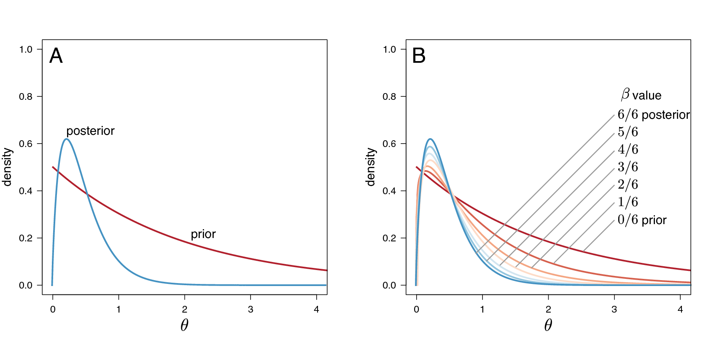
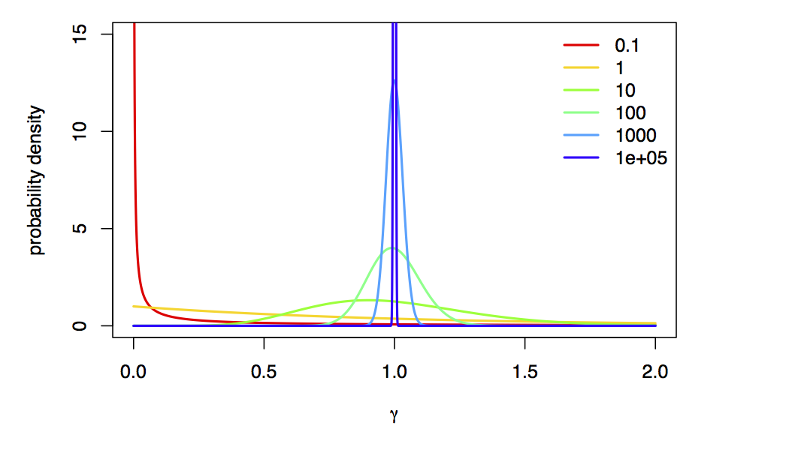
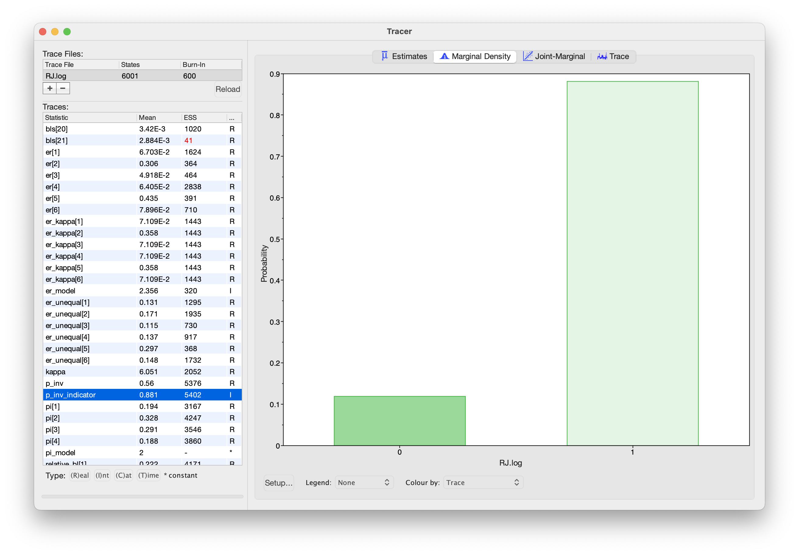

In this tutorial, we will learn how to use Bayesian model selection tools to compare between alternative substitution models. We will also use Bayesian model averaging with reversible-jump MCMC to average over uncertainty in substitution models.



For most sequence alignments, several (possibly many) substitution
models of varying complexity are plausible *a priori*. We therefore need
a way to objectively identify the model that balances estimation bias
and inflated error variance associated with under- and
over-parameterized models, respectively. Increasingly, model selection
is based on *Bayes factors* [*e.g.*,
], which
involves first calculating the marginal likelihood of each candidate
model and then comparing the ratio of the marginal likelihoods for the
set of candidate models.

Given two models, $M_0$ and $M_1$, the Bayes-factor comparison assessing
the relative fit of each model to the data, $BF(M_0,M_1)$, is:

$$\begin{aligned}
BF(M_0,M_1) = \frac{\mathbb{P}(\mathbf X \mid M_0)}{\mathbb{P}(\mathbf X \mid M_1)},
\end{aligned}$$

where $\mathbb{P}(\mathbf X \mid M_i)$ is the *marginal likelihood*
of model $M_i$ (this may be familiar to you as the denominator of Bayes
Theorem, which is variously referred to as the *model evidence* or
*integrated likelihood*). Formally, the marginal likelihood is the
probability of the observed data ($\mathbf X$) under a given model
($M_i$) that is averaged over all possible values of the parameters of
the model ($\theta_i$) with respect to the prior density on $\theta_i$

$$\begin{equation}
\mathbb{P}(\mathbf X \mid M_i) = \int \mathbb{P}(\mathbf X \mid \theta_i) \mathbb{P}(\theta_i)dt.
\tag{Marginal Likelihood}\label{eq:marginal_likelihood}
\end{equation}$$

This makes it clear that more complex (parameter-rich) models are
penalized by virtue of the associated prior: each additional parameter
entails integration of the likelihood over the corresponding prior
density.

Note that interpreting Bayes factors involves some subjectivity. That
is, it is up to *you* to decide the degree of your belief in $M_0$
relative to $M_1$. Despite the absence of an absolutely objective
model-selection threshold, we can refer to the scale [outlined by
] that provides a "rule-of-thumb" for interpreting these
measures ().


 |   **Strength of evidence**   |   BF($M_0$,$M_1$)**  | **log(BF($M_0$,$M_1$))** | **$log_{10}(BF(M_0$,$M_1))$**  |
  -----------------------------:|:--------------------:|:------------------------:|:------------------------------:|
 |   Negative (supports $M_1$)  |         $<1$         |            $<0$          |             $<0$               |
 |    Barely worth mentioning   |     $1$ to $3.2$     |         $0$ to $1.16$    |          $0$ to $0.5$          |
 |          Substantial         |     $3.2$ to $10$    |      $1.16$ to $2.3$     |        $0.5$ to $1$            |
 |            Strong            |    $10$ to $100$     |      $2.3$  to $4.6$     |        $1$ to $2$              |
 |           Decisive           |        $>100$        |            $>4.6$        |             $>2$               |


The scale for interpreting Bayes factors by Harold .



We can perform a Bayes factor comparison of two models by
calculating the marginal likelihood for each one. Alas, exact solutions
for calculating marginal likelihoods are not known for phylogenetic
models (see equation \eqref{eq:marginal_likelihood}), thus we must resort to numerical integration methods to estimate or approximate these values. In this
exercise, we will estimate the marginal likelihood for each model
using both the stepping-stone  and path
sampling estimators .



The models we use here are equivalent to the models described in the
previous exercise on substitution models (continuous time Markov
models). To specify the model please consult the previous exercise.
Specifically, you will need to specify the following substitution
models:

-   Jukes-Cantor (JC) substitution model 
-   General-Time-Reversible (GTR) substitution model 
-   Gamma (+G) model for among-site rate variation 
-   Invariable-sites (+I) model 

The scripts we use to specify these models are almost identical to those we used in our previous tutorial, [Bayesian phylogenetic inference with GTR](https://boussau.github.io/tutorials/COME_tutorials/8_RevBayesTutorial/).
The main difference is that we must perform a so-called "power-posterior" analysis instead of a standard MCMC analysis.



We will estimate the marginal likelihood of a given model using a
power-posterior algorithm. This algorithm is
similar to the familiar MCMC algorithms, which are intended to sample
from (and estimate) the joint posterior probability of the model
parameters. Power-posterior algorithms are like a series of MCMC
simulations that iteratively sample from a specified number of
distributions that are discrete steps between the posterior and the
prior probability distributions. The basic idea is to estimate the
probability of the data for all points between the posterior and the
prior—effectively summing the probability of the data over the prior
probability of the parameters to estimate the marginal likelihood.
Technically, the steps correspond to a series of `powerPosteriors()`,
where the likelihood is iteratively raised to a series of numbers
between 1 and 0 (Figure [fig:ss]). When the likelihood is raised to
the power of 1 (typically the first stepping stone), samples are drawn
from the (untransformed) posterior. By contrast, when the likelihood is
raised to the power of 0 (typically the last stepping stone), samples
are drawn from the prior. To perform a stepping-stone simulation, we
need to specify (1) the number of stepping stones (power posteriors)
that we will use to traverse the path between the posterior and the
prior (*e.g.*, we specify 50 or 100 stones),
(2) the spacing of the stones between the posterior and prior
(*e.g.*, we may specify that the stones are
distributed according to a beta distribution), (3) the number of samples
(and their thinning) to be drawn from each stepping stone, and (4) the
direction we will take (*i.e.*, from the
posterior to the prior or vice versa).




Estimating marginal likelihoods using power-posterior simulation. Estimating the marginal likelihood involves integrating the likelihood of the data over the entire prior probability density for the model parameters. MCMC algorithms target the posterior probability density, which is typically concentrated in a small region of the prior probability density (A). Accordingly, standard MCMC simulation cannot provide unbiased estimates of the marginal likelihood because it will typically fail to explore most of the prior density. (B) Power-posterior algorithms estimate the marginal likelihood by means of a series of MCMC-like simulations, where the likelihood is iteratively raised to a series of powers, effectively forcing the simulation to more fully explore the prior density of the model parameters. Here, six uniformly spaced stones span the posterior, where the power posterior is $\beta=6/6=1$, to the prior, where the power posterior is $\beta=0/6=0$.



This method computes a vector of powers from a beta distribution, then
executes an MCMC run for each power step while raising the likelihood to
that power. In this implementation, the vector of powers starts with 1,
sampling the likelihood close to the posterior and incrementally
sampling closer and closer to the prior as the power decreases.



We'll begin with the simplest substitution model, the Jukes-Cantor model.
We specify this model in the `powp_JC.Rev` script. Here, we focus on the parts of this code that are specific to power-posterior analysis, rather than the substitution model itself. To perform a power-posterior analysis, we replace the standard `mcmc()` analysis function with the `powerPosterior()` analysis function. This function is similar to the standard MCMC, but we must specify the number of powers (stones) to use (`cats`), the filename(s) for the samples from individual stones, and the frequency with which to write sampled likelihood values to file (`sampleFreq`):
```
# We create a power-posterior object:
pow_p = powerPosterior(my_model, moves, monitors, filename="analyses/"+output_stub+".out", sampleFreq=5, cats=20)
```
(note that `output_stub` was a variable that we can change for each model, in this case it is `ppJC`, because we're doing a power-posterior analysis with the Jukes-Cantor model).

Now we run the power-posterior analysis:
```
# We run _each stone_ MCMC for 5,000 iterations:
pow_p.run(generations=5000)
```
Note that the number of generations is _per stone_! That means that this stepping-stone analysis will actually perform `cats * generations` total generations.
Also note that this analysis will perform a short burnin for each stone (by default, 10%), which adapts the MCMC proposals to the current stone.

After the power-posterior analysis completes, we read the samples back into RevBayes to compute the marginal likelihood either with the path-sampler or stepping-stone sampler algorithms:
```
# compute the marginal likelihood with the path-sampling equation
ps = pathSampler(file="analyses/"+output_stub+".out", powerColumnName="power", likelihoodColumnName="likelihood")
print("Marginal likelihood (path sampling):  " + ps.marginal())

# compute the marginal likelihood with the stepping-stone equation
ss = steppingStoneSampler(file="analyses/"+output_stub+".out", powerColumnName="power", likelihoodColumnName="likelihood")
print("Marginal likelihood (stepping-stone): " + ss.marginal())
```

For a small number of stones, the stepping-stone sampler should provide a more accurate estimate of the marginal likelihood. However, as the number of stones increases, we expect the estimates to converge. Therefore, it's a good idea to use both estimators to check that they are close to each other (which indicates that the estimates are relatively stable).



-   Compute the marginal likelihoods of the *cytb* alignment for the
    following substitution models:
    1.  Jukes-Cantor (JC) substitution model
    2.  General-Time-Reversible (GTR) substitution model
    3.  GTR with gamma distributed-rate model (GTR+G)
    4.  GTR with invariable-sites model (GTR+I)
    5.  GTR+I+G model
-   Enter the marginal likelihood estimate for each model in the
    corresponding cell of the table below.
-   Which is the best fitting substitution model?



 |       **Model**        |   **Path-Sampling**   |   **Stepping-Stone-Sampling**   |
  -----------------------:|:---------------------:|:-------------------------------:|
 |        JC ($M_1$)      |                       |                                 |
 |       GTR ($M_2$)      |                       |                                 |
 |  GTR+$\Gamma$ ($M_3$)  |                       |                                 |
 |      GTR+I ($M_4$)     |                       |                                 |
 | GTR+$\Gamma$+I ($M_5$) |                       |                                 |


Marginal likelihoods for different substitution models.






Sometimes, the data are indecisive about which model is preferred by Bayes factor.
We call this phenomenon _model uncertainty_ because we're actually uncertain about
which model is the best description of the process that generated our data.
The natural Bayesian solution to this problem is simply to treat the model itself as a random variable,
which averages parameter estimates (including the tree, branch lengths,
and all substitution model parameters) over the uncertainty in the model itself.
We accomplish this (generally) using a special "reversible-jump" MCMC algorithm
(also known "rjMCMC", "transdimensional MCMC", or "the Green algorithm")
which adds, removes, or combines parameters to move between models.

The state space of potential models is vast, so we'll restrict ourselves to a very particular set of
models, in particular, we're going to average over the "named" members of the GTR models
(the ones you learned specifically in class), models with and without Gamma-distributed ASRV, and models with and without a proportion of invariable sites.

This analysis is specified in the `RJ_MCMC.Rev` script; in this example, we use ITS sequences from the genus _Fagus_ (Beech trees). We will skip over details of this script that do not relate to the substitution model, for example the tree topology and branch lengths, and instead focus on the model-averaging aspects of this script.



We use the distribution `dnReversibleJumpMixture` to jump between models with uniform (equal) and non-uniform stationary frequencies.
To use this distribution, we must provide: 1) a fixed value (the value the parameter takes when it is not estimated), 2) a prior distribution (for when the parameter value is estimated), and 3) the prior probability that the parameter is estimated.
```
# We first define reversible jump over uniform and non-uniform stationary frequencies
# to construct the stationary frequency mixture
pi ~ dnReversibleJumpMixture(simplex(v(1,1,1,1)), dnDirichlet(v(1,1,1,1)), 0.5)
```

Now, we use an MCMC proposal that moves between the two models (equal and non-equal), as well as a proposal that modifies the parameter value when it is estimated:
```
# include proposals for jumping between models, as well as for the
# parameter when it is estimated
moves.append( mvRJSwitch(pi, weight=10.0) )
moves.append( mvBetaSimplex(pi, weight=2.0) )
```

Finally, we will keep track of which stationary frequency model the MCMC is visiting, by creating a helper variable that is `0` when the frequencies are equal, and `1` when the frequencies are estimated:

```
# We track whether the stationary frequencies are uniform
pi_model := ifelse(pi == simplex(v(1,1,1,1)), 1, 2)
```



We will consider three models for exchangeability rates: 1) a model with equal exchangeability rates, 2) a model with a transition-transversion rate parameter, and 3) a model where all exchangeability rates are different.
In this case, we won't be to use the `dnReversibleJumpMixture` distribution because we have more than two models.
Instead, we'll specify separate exchangeability-rate parameters for each model, and then sample the exchangeability rates from among those models.

We begin by specifying the equal-rates model.
In this case, all exchangeability rates are the same, so there are no free parameters:
```
# 1. An equal rates model
er_flat <- simplex(rep(1,6))
```

Next, we specify a model with transition and transversion rates using the parameter `kappa`.
We first create the `kappa` parameter:
```
# 2. A model with different transition and transversion rates
kappa ~ dnUniform(0, 10)
moves.append( mvScale(kappa, weight=2.0) )
```
and then we create a vector of exchangeability rates using `kappa`:
```
er_kappa := simplex(v(1, kappa, 1, 1, kappa, 1))
```

Finally, we specify a model with unequal exchange rates by drawing them from a Dirichlet prior:
```
# 3. A model with unequal exchange rates
er_unequal ~ dnDirichlet(v(1,1,1,1,1,1))
moves.append( mvBetaSimplex(er_unequal, weight=2.0) )
```

Now that we have specified our three exchangeability-rate models, we group them together in a single vector:
```
# We place all of the exchange rates in a list of rates...
er_vec := v(er_flat, er_kappa, er_unequal)
```
and then draw the exchangeability rates to use in the model from a mixture distribution:
```
# ... and then we draw the exchange rates from this list
er ~ dnMixture( values=er_vec, probabilities=simplex(rep(1, er_vec.size())) )
```
This distribution draws the `er` parameter from among the provided `values` (`er_vec`), each with equal prior probability (specified with `simplex(rep(1, er_vec.size()))`).
We then provide a move that proposes to change `er` to one of the other values in the `er_vec` vector:
```
moves.append( mvGibbsMixtureAllocation(er, weight=10.0) )
```

Once again, we set up a helper variable to keep track of which model we are visiting:
```
# We track which exchange-rate vector we are visiting
er_model := ifelse(er == er_flat, 1, ifelse(er == er_kappa, 2, 3))
kappa_indicator := ifelse(er == er_kappa, 1, 0)
er_unequal_indicator := ifelse(er == er_unequal, 1, 0)
```

Now that we have both stationary frequencies and exchangeability rates, we can provide them to the `fnGTR` function to create our Q matrix:
```
# Finally, we use the stationary frequencies and exchange rates to construct
# a model (using the most generic GTR model)
Q := fnGTR(er, pi)
```



We can jump over Gamma-distributed rate models using `dnReversibleJumpMixture` like so:
```
# We jump between models with and without rate heterogeneity across sites
# A model without rate heterogeneity is like a model with rate heterogeneity,
# but with a high alpha value
alpha ~ dnReversibleJumpMixture(10000, dnUniform( 0, 10 ), 0.5)
```
In this case, we are moving between models with a very large `alpha` value (10000) and with estimated alpha values (between 0 and 10 _a priori_).
We're using a value of `alpha=10000` to approximate "no rate variation",
because, as $\alpha \rightarrow \infty$, the Gamma-model collapse to a spike at 1 (i.e., approximately no rate variation):




Gamma distribution for different choices of $\alpha$.



As before, we specify proposals for the model as well as `alpha`, and construct the site-rates vector using the sampled value of `alpha`:
```
# We define a move on the parameter of the gamma distribution for rate heterogeneity across sites:
moves.append( mvRJSwitch(alpha, weight=5.0) )
moves.append( mvScaleBactrian(alpha, weight=2.0, tune=TRUE) )

# We compute the site rates for the sampled value of alpha
sr := fnDiscretizeGamma( alpha, alpha, 4 )
```

Finally, we track whether `alpha` is "included" in the model:
```
alpha_indicator := ifelse(alpha == 10000, 0, 1)
```



Finally, we jump over models without invariable sites (`p_inv = 0`) and models with invariable sites (`p_inv > 0`).
This works very similarly to the stationary frequency and ASRV models, so we will skip the gory details:
```
# We jump between models with and without invariable sites
p_inv ~ dnReversibleJumpMixture(0, dnBeta(1,1), 0.5)

# We keep track of whether pinv is "included" in the model
p_inv_indicator := ifelse(p_inv == 0, 0, 1)

# We define a move on the proportion of invariable sites parameter
moves.append( mvRJSwitch(p_inv, weight=5.0) )
moves.append( mvSlide(p_inv, tune=TRUE) )
```



We've set these models up in such a way that the likelihood function doesn't need to know the exact identity of the model! That is, in all cases we have _some_ value of `pi`, `er`, `site_rates`, and `p_inv`, regardless of the identify of the current model (i.e., whether or not a particular model component is "included" in the model).
Therefore, we can simply pass these variables to the CTMC model as we did in the previous tutorial:
```
seq ~ dnPhyloCTMC( tree=psi, Q=Q, siteRates=sr, pInv=p_inv, type="DNA")
```



Beyond having special prior distribution and proposals for reversible-jump models, there is nothing special we have to do to run this analysis: it is just a regular MCMC at this point!
We create our model and monitors as before, and run a standard MCMC as we did in the previous tutorial.
Because we sample the substitution models in proportion to their posterior probability, our estimates of the phylogeny will naturally average over uncertainty in the substitution models.



In addition to averaging our phylogenetic estimates over uncertainty in the substitution model, we can also use RJ MCMC to estimate the posterior probabilities of the models themselves!
When using RJ MCMC, the posterior probability of a given model is the fraction of times that model is sampled during the MCMC.
Here, we examine the posterior probability of the invariable-sites models:



The posterior distribution of the `p_inv` indicator. When `p_inv_indicator` is 0, the invariable-sites model is "turned off"; when it is 1, it is "turned on". Therefore, the fraction of samples for which `p_inv_indicator = 1` is the posterior probability of the invariable-sites model.





- Run the reversible-jump MCMC analysis on the _Fagus_ ITS dataset.
- Then, repeat the analysis with the matK and rbcL datasets.
- Enter the posterior probabilities for each model/locus combination in the corresponding cell of the table below.



|       **Model**        |   **ITS**             |   **matK**                      |   **rbcL**             |
 -----------------------:|:---------------------:|:-------------------------------:|:----------------------:|
| Unequal stationary frequencies | | | |
| Transition-transversion model | | | |
| Unequal exchange-rates model | | | |
| Gamma-distributed rates | | | |
| Invariable sites| | | |


Posterior probabilities for different substitution model components by dataset.



<!--  -->
