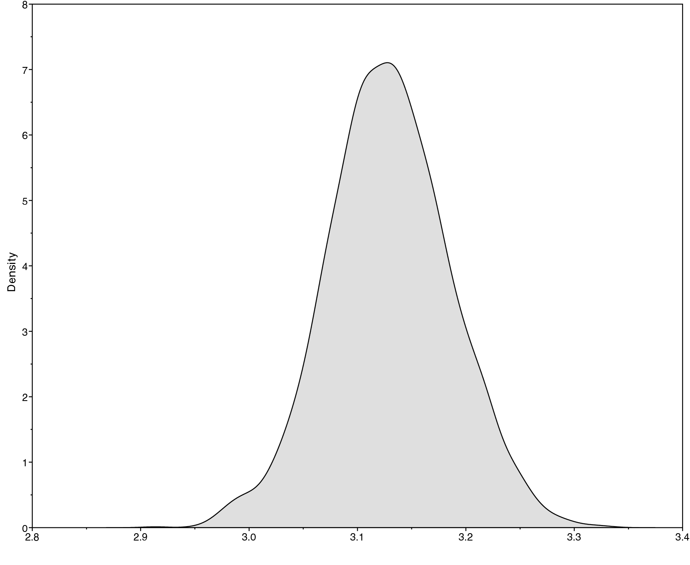
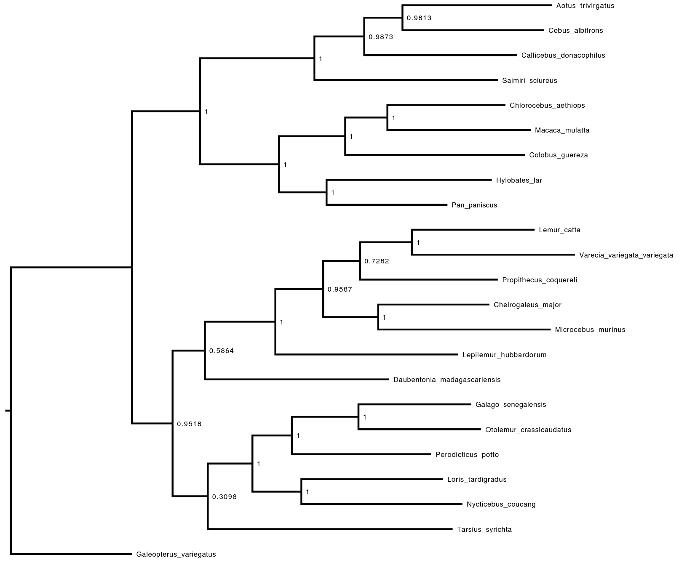

This tutorial demonstrates how to set up a Jukes and Cantor (1969, herafter
named JC) model of
nucleotide substitution, and then how to perform simulations and phylogenetic
inference using this model.
JC is the simplest model for describing nucleotide sequence evolution. It is
a continuous time Markov chain (ctmc) model. In general ctmc models are
fully characterized by their instantaneous-rate matrix:

$$Q = \begin{pmatrix}
-\mu_A & \mu_{AC} & \mu_{AG} & \mu_{AT} \\
\mu_{CA} & -\mu_C  & \mu_{CG} & \mu_{CT} \\
\mu_{GA} & \mu_{GC} & -\mu_C  & \mu_{GT} \\
\mu_{TA} & \mu_{TC} & \mu_{TG} & -\mu_T
\end{pmatrix} \mbox{  ,}$$

where $\mu_{ij}$ represents the instantaneous rate of substitution from
state $i$ to state $j$. The diagonal elements $\mu_i$ are the rates of
*not* changing out of state $i$, equal to the sum of the elements in the
corresponding row. 

Each of the named substitution models (e.g., JC, TN92, HKY or GTR)
has a uniquely defined instantaneous-rate matrix, $Q$.

In this tutorial you will perform phylogeny inference under the simplest
model of DNA sequence evolution: JC. In the next tutorial, you will explore
other models with names such as F81, HKY85, TN92, GTR, GTR+Gamma.
In this tutorial, you will first simulate sequences using the JC model, and
then perform phylogenetic inference from a sequence alignment.
This inference will be based on the Markov chain Monte Carlo (MCMC) algorithm to
 estimate the phylogeny and other model parameters such as branch lengths. The
estimated trees will be unrooted trees with independent branch-length
parameters.



Specific functions for substitution models available in RevBayes.


 |   **Model**      |        **Reference**        |  **Function**   |      **Parameters**     |
 |:----------------:|:---------------------------:|:---------------:|:-----------------------:|
 |   Jukes-Cantor   |         |      fnJC       |           -             |
 | K80 (a.k.a. K2P) |        |      fnK80      |        $\kappa$         |
 |  Felsenstein-81  |   |      fnF81      |         $\pi$           |
 |        T92       |        |      fnT92      | $\pi_{GC}$, $\kappa$    |
 |        HKY       |      |      fnHKY      |     $\pi$, $\kappa$     |
 |        GTR       |        |      fnGTR      |     $\pi$, $\epsilon$   |







This tutorial involves:
1. setting up a Jukes-Cantor (JC) substitution model for an alignment of the cytochrome b subunit;
2. simulating DNA sequence evolution;
3. approximating the posterior probability of the tree topology and branch
lengths using MCMC;
4. summarizing the MCMC output by computing the maximum *a posteriori* tree.





Graphical model representation of a simple phylogenetic model. The graphical model shows the dependencies among parameters . Here, the rate matrix $Q$ is a constant variable because it is fixed and does not depend on any parameter. The only free parameters of this model, based on the Jukes-Cantor model of substitution, are the tree topology $\tau$ and the branch lengths ($bl$).



We first consider the simplest substitution model described by
. The instantaneous-rate matrix for the JC substitution
model is defined as

$$Q_{JC} = \begin{pmatrix}
{*} & \frac{1}{3} & \frac{1}{3} & \frac{1}{3} \\
\frac{1}{3} & {*} & \frac{1}{3} & \frac{1}{3} \\
\frac{1}{3} & \frac{1}{3} & {*} & \frac{1}{3} \\
\frac{1}{3} & \frac{1}{3} & \frac{1}{3} & {*}
\end{pmatrix} \mbox{  ,}$$



The files for this example analysis are provided for you ([`mcmc_JC.Rev`](scripts/mcmc_JC.Rev)).
If you download this file and place it in a directory called `scripts` inside your main tutorial directory,
you can easily execute this analysis using the `source()` function in the RevBayes console:

```
source("scripts/simulation_JC.Rev")
```

This simulation should be fast, and should have produced two files in the
folder `data`: `simulatedSequences_1.fasta` and `simulatedSequences_2.fasta`.

Below we are going to go through the script and explain what it does, step by step.




The first thing the script does is to load a DNA alignment. Although this step is
not necessary for simulating an alignment, here we use the empirical alignment
just to get its number of sequences, its number of sites, and the sequence names.
We will also compare the simulated sequences with the empirical sequences.

We load in the sequences using the `readDiscreteCharacterData()`
function.

```
data <- readDiscreteCharacterData("data/primates_and_galeopterus_cytb.nex")
```

Executing this line initializes the data matrix as a variable in the Rev
environment. You can have a look at the list of variables in the environment as
follows:
```
ls()
```

To report the current value of any variable, simply
type the variable name and press enter. For the `data` matrix, this
provides information about the alignment:


```
data
```
```
   DNA character matrix with 23 taxa and 1141 characters
   =====================================================
   Origination:                      primates_and_galeopterus_cytb.nex
   Number of taxa:                   23
   Number of included taxa:          23
   Number of characters:             1141
   Number of included characters:    1141
   Datatype:                         DNA
```
{:.Rev-output}

Next we will specify some useful variables based on our dataset. The variable
`data` has *member functions* that we can use to retrieve information about the
dataset. These include, for example, the number of species and the taxa.
We will need that taxon information for setting up different parts of our model.

```
num_taxa <- data.ntaxa()
num_branches <- 2 * num_taxa - 3
taxa <- data.taxa()
num_sites <- data.nchar()
```

Here, we are defining constants of our model. In RevBayes, we define constants using "<-".
We will see later that we have two other assignment operators, for the random and deterministic variables of the model.

With the data loaded, we can now proceed to specifying the model.



Simulating DNA sequences with an unrooted tree under the JC model requires
specification of two main components:
(1) the  and (2) the .



A given substitution model is defined by its corresponding
instantaneous-rate matrix, $Q$. The Jukes-Cantor substitution model does
not have any free parameters (as the substitution rates are all assumed
to be equal), so we can define it as a constant variable. The function
`fnJC(n)` will create an instantaneous-rate matrix for a character with
$n$ states. Since we use DNA data here, we create a 4x4
instantaneous-rate matrix:

```
Q <- fnJC(4)
```

You can see the rates of the $Q$ matrix by typing

```
Q
```
```
   [ [ -1.0000, 0.3333, 0.3333, 0.3333 ] ,
     0.3333, -1.0000, 0.3333, 0.3333 ] ,
     0.3333, 0.3333, -1.0000, 0.3333 ] ,
     0.3333, 0.3333, 0.3333, -1.0000 ] ]
```
{:.Rev-output}

As you can see, all substitution rates are equal.



The tree topology and branch lengths are unknown (we want to estimate them). In Bayesian inference, we formalize this by defining them as random variables, with a prior probability distribution. In the graphical representation of our model, random variables are always shown by plain circles. They are also called stochastic nodes of our phylogenetic model.
In , the tree topology is denoted $\tau$ and the
length of the branch leading to node $i$ is $bl_i$.

We will assume that all possible labeled, unrooted tree topologies have equal probability a priori.
This is the `dnUniformTopology()` distribution in RevBayes.
In RevBayes it is advisable to specify the outgroup for your study system.
Here, we will use Galeopterus, which is the sister group to all other primates.

Specify the `topology` stochastic node by passing in the list of `taxa` and the outgroup
to the `dnUniformTopology()` distribution:

```
out_group = clade("Galeopterus_variegatus")
topology ~ dnUniformTopology(taxa, outgroup=out_group)
```
See how we define a new random variable (or a new stochastic node) of our model: by using the stochastic operator '~'. Thus, it is different from constants, for which we used '<-'.

Next we have to create a stochastic node representing the length of each of the
$2N - 3$ branches in our tree (where $N=$ `n_species`). We can do this using a
`for` loop. In this loop, we can create each of the branch-length nodes.
Each branch length is a random variable, and we have to define a prior for each of them. Note that the branch lengths are measured in number of substitutions per site. Usually, these numbers are relatively small (of the order of $0.01$ or $0.1$). Usually, in phylogenetics, we use an exponential prior of mean $0.1$ for branch lengths. Equivalently, we use an exponential of rate 10 (the rate of an exponential distribution is the inverse of the mean).

Altogether, you can copy this entire
block of Revcode into the console:

```
for (i in 1:num_branches) {
   br_lens[i] ~ dnExponential(10.0)
}
```

See how we have defined a vector of branch lengths, just by defining all its components, using a for loop and using the indexation operator '[]'. Also, as above for the tree topology, we again use the stochastic operator '~'.

Finally, we can create a *phylogram* (a phylogeny in which the branch lengths are
proportional to the expected number of substitutions per site) by combining the
tree topology and branch lengths. We do this using the `treeAssembly()` function,
which applies the value of the $i^{th}$ member of the `br_lens` vector to the
branch leading to the $i^{th}$ node in `topology`:

```
psi := treeAssembly(topology, br_lens)
```
The `psi` variable is a deterministic node: its value is entirely determined by its two parents, topology and br_lengths (in the present case, it is just a container that puts together these two components of the model). Deterministic nodes are created using the ':=' assignment operator. This is different from '<-', which was used for constants, because deterministic nodes will have to update their value when we will change the value of their parents.



We have fully specified all of the parameters of our phylogenetic
model—the tree topology with branch lengths, and the substitution model
that describes how the sequence data evolve over the tree with branch
lengths. Collectively, these parameters comprise a distribution called
the *phylogenetic continuous-time Markov chain*, and we use the
`dnPhyloCTMC` constructor function to create this node. This
distribution requires several input arguments:
1. the `tree` with branch lengths;
2. the instantaneous-rate matrix `Q`;
3. the `type` of character data.

Build the random variable for the character data (sequence alignment).
```
seq ~ dnPhyloCTMC(tree=psi, Q=Q, type="DNA", nSites=num_sites)
```





Building the `seq` random variable automatically simulated sequences. You can
output them to a file:

```
writeFasta(filename="data/simulatedSequences_1.fasta", data=seq)
```

You can then view this alignment, for instance using
[seaview](http://doua.prabi.fr/software/seaview).

You can simulate another data set by "redrawing" the random variable:
```
seq.redraw()
```

And you can write the new sequences to another file:
```
writeFasta(filename="data/simulatedSequences_2.fasta", data=seq)
```
-   **Are they different from the first ones?**

It is always important to evaluate the realism of simulations. In our case, we
can compare the simulated alignment to the empirical alignment.
The sequence data objects ("AbstractHomologousDiscreteCharacterData")
have lots of functions that we can use for this purpose:
```
data.methods()
```

Let's use some of them to compare the empirical data to the simulated data set:
```
print("Mean GC content of the empirical data: " + data.meanGcContent())
print("Mean GC content of the simulated data: " + seq.meanGcContent())
print("Variance of the GC content of the empirical data: " + data.varGcContent())
print("Variance of the GC content of the simulated data: " + seq.varGcContent())
```
-   **Can you think of other statistics that might be interesting to compute
to compare the empirical and the simulated data sets?**




In the first part of this tutorial, we saw how to simulate a DNA alignment
using the JC model.
The second part aims at performing inference under the JC model.

The inference script is called `scripts/mcmc_JC.Rev`.
You can run it in its entirety as follows:

```
source("scripts/mcmc_JC.Rev")
```


If everything loaded properly, then you should see the program initiate
the Markov chain Monte Carlo analysis that estimates the posterior
distribution. If you continue to let this run, then you will see it
output the states of the Markov chain once the MCMC analysis begins.

Ultimately, this is how you will execute most analyses in RevBayes, with the full
specification of the model and analyses contained in the sourced files.
You could easily run this entire analysis on your own data by substituting your
data file name for that in the model-specification file. However, it is important
to understand the components of the model to be able to take full advantage of
the flexibility and richness of RevBayes. Furthermore, without inspecting the
Rev scripts sourced in `mcmc_JC.Rev`, you may end up inadvertently performing
inappropriate analyses on your dataset, which would be a waste of your time and
CPU cycles. The next steps will walk you through the full specification of the
model and MCMC analyses.





Overall, the inference script is very similar to the simulation script. For instance,
the structure of the model is the same. However, to perform inference, additional
elements have to be included. In particular, the model that we were using for
simulation has to be *conditioned* upon observed data, the sequences at the tips.
Secondly, the whole model has to be assembled into a *model* variable, upon
which MCMC sampling will be able to operate. Thirdly, *moves* need to be specified for
each stochastic variable, so that we can obtain posterior distributions. Recall
that moves are algorithms used to propose new parameter values during the MCMC
simulation. Fourthly, we may want to specify *monitors* to record parameter
values as the MCMC algorithm proceeds. Monitors print the values of model parameters
to the screen and/or log files during the MCMC analysis.



The `PhyloCTMC` model is able to produce sequence alignments, given parameter
variables. We can attach our sequence data to the tip nodes in the tree:

```
seq.clamp(data)
```

Note that although we assume that our sequence data are random
variables—they are realizations of our phylogenetic model—for the
purposes of inference, we assume that the sequence data are “clamped” to their
observed values.
When this function is called, RevBayes sets each of the stochastic
nodes representing the tips of the tree to the corresponding nucleotide
sequence in the alignment. This essentially tells the program that we
have observed data for the sequences at the tips: we are *conditioning* the
model on these data.




We wrap the entire model in a single object to provide convenient access to the
Directed Acyclic Graph. To do this, we only need to give the `model()` function a single
node of the model. Starting from this node, the `model()` function can find all of the other
nodes by following the arrows in the graphical model:

```
mymodel = model(Q)
```

Now we have specified a simple phylogenetic model—each parameter of
the model will be estimated from every site in our alignment. If we
inspect the contents of `mymodel` we can review all of the nodes in the
DAG:

```
mymodel
```




For each stochastic variable of the model, we need to specify a move. If no move
is specified for a stochastic variable, this variable will stay constant throughout
the entire algorithm.

First we create a vector to store all the moves that will be used to sample from
the posterior distribution:
```
moves = VectorMoves()
```

You may have noticed that we used the `=` operator to create the move index.
This simply means that the variable is not part of the model: it is not used to
compute the probability of a set of parameter values. Instead, it is a part
of the MCMC algorithm.
You will later see that we use this operator for other variables that are not
part of the model, e.g., when we create moves and monitors.

For instance, we specify a move
for the tree topology.
```
moves.append( mvNNI(topology, weight=3) )
```

Some types of stochastic nodes, and the tree topology in particular, can be
updated by a number of alternative moves.
Different moves may explore parameter space in different ways,
and it is possible to use multiple different moves for a given parameter to improve mixing
(i.e. the efficiency of the MCMC simulation).
In the case of our unrooted tree topology, for example, we can use both a
nearest-neighbor interchange move  (`mvNNI` in the Rev language) and a subtree-prune and regraft move  (`mvSPR` in the Rev language, currently commented in the script).





The NNI move swaps two subtrees around an internal branch. Source: [https://en.wikipedia.org/wiki/Tree_rearrangement](https://en.wikipedia.org/wiki/Tree_rearrangement)






The SPR moves prunes a subtree, and reattaches it somewhere else in the tree. Source: [https://en.wikipedia.org/wiki/Tree_rearrangement](https://en.wikipedia.org/wiki/Tree_rearrangement)




These moves do not have tuning parameters associated with them, thus we only need
to pass in the `topology` node and proposal `weight`.

```
moves.append( mvSPR(topology, weight=3) )
```

The weight specifies how often the move will be applied either on average per
iteration or relative to all other moves. Have a look at the
[MCMC tutorials](https://revbayes.github.io/tutorials/) for more details
about moves and MCMC strategies.

The other stochastic variables in the model are branch lengths. They need their
own moves:

```
for (i in 1:num_branches) {
    moves.append( mvScale(bl[i]) )
}
```

Here each branch length is associated to a `mvScale` move that basically multiplies
the current value of a branch length by a real positive random number.

-   **What type of stochastic variable is particularly appropriate for the `mvScale`
move?**




During the MCMC analysis, we can decide to keep track of all the sampled parameters,
but also of various statistics that we think may be of interest. Here, we have
decided to keep track of the tree length, i.e. the sum of all branch lengths.
To this end, we add a variable `TL` that will compute this sum. Accordingly, the tree
length can be computed using the `sum()` function, which calculates the sum of
any vector of values.

```
TL := sum(br_lens)
```

-   **Why are we using ":=" here?**


For our MCMC analysis, we need to set up a vector of *monitors* to
record the states of our Markov chain. The monitor functions are all
called `mn\*`, where `\*` is the wild-card representing the monitor type.
First, we will initialize the model monitor using the `mnModel`
function. This creates a new monitor variable that will output the
states for all model parameters when passed into a MCMC function.

```
monitors = VectorMonitors()

monitors.append( mnModel(filename="output/primates_cytb_JC.log", printgen=10) )
```

The `mnFile` monitor will record the states for only the parameters
passed in as arguments. We use this monitor to specify the output for
our sampled phylograms.

```
monitors.append( mnFile(filename="output/primates_cytb_JC.trees", printgen=10, psi) )
```

Finally, we create a screen monitor that will report the states of
specified variables to the screen with `mnScreen`:

```
monitors.append( mnScreen(printgen=100, TL) )
```

This monitor mostly helps us to see the progress of the MCMC run.



With a fully specified model, a set of monitors, and a set of moves, we
can now set up the MCMC algorithm that will sample parameter values in
proportion to their posterior probability. The `mcmc()` function will
create our MCMC object:

```
mymcmc = mcmc(mymodel, monitors, moves)
```

```
mymcmc = mcmc(mymodel, monitors, moves, nruns=1)
```

Notice that we also specified `nruns=1` in the interest of speed. If we had
set `nruns=4`, RevBayes would have run 4 independent MCMC runs. In general, it
is recommended to run several chains: comparing them enables ensuring that the
chains have converged to the same area of the posterior distribution. Usually,
the more chains, the better. In such a case, the output is created in e.g. 4 files with
extension `_run_1`, `_run_2`, ... for each replicate and additionally the samples
from all runs are combined into one file with extension `mixed` for more
convenient post-processing.


Now, run the MCMC:
```
mymcmc.run(generations=2500)
```
Here we set a low number of iterations. In general it is recommended to check
for convergence; here it is possible that 2500 iterations may not be enough.

When the analysis is complete, you will have the files produced by the monitors
in your output directory.



MCMC analyses can take a long time to converge, and it is usually difficult to
predict how many generations will be needed to obtain results. In addition, many
analyses are run on computer clusters with time limits, and so may be stopped by
the cluster partway through. For all of these reasons, it is useful to save the
state of the chain regularly through the analysis.
```
mymcmc.run(generations=100000000, checkpointInterval=100, checkpointFile="output/primates_cytb_JC.state")
```

The `checkpointInterval` and `checkpointFile` inputs specify respectively how
often, and to which file, the chain should be saved. Three different files will
be used for storing the state: one with no extension, one with extension `_mcmc`,
 and one with extension `_moves`.
When multiple independent runs are specified, they will automatically be saved
in separate files (with extensions `_run_1`, `_run_2`, etc.).

Restarting the chain from a previous run is done by adding this line:
```
mymcmc.initializeFromCheckpoint("output/primates_cytb_JC.state")
```
before calling the function `mcmc.run()`. The file name should match what was given as `checkpointFile` when running the previous analysis. **NB:** Note that this line will create an error if the state file does not exist yet, and so should be commented out in the first run.

The full MCMC block thus becomes:
```
mymcmc = mcmc(mymodel, monitors, moves, nruns=1)
mymcmc.initializeFromCheckpoint("output/primates_cytb_JC.state") #comment this out for the first run

mymcmc.run(generations=100000000, checkpointInterval=100, checkpointFile="output/primates_cytb_JC.state")
```






Methods for visualizing the marginal densities of parameter values are not
currently available in RevBayes itself.
Thus, it is important to use programs like
[Tracer](http://tree.bio.ed.ac.uk/software/tracer/) 
to evaluate mixing and non-convergence.

Look at the file called `output/primates_cytb_JC.log` in Tracer.
There you see the posterior distribution of the continuous parameters,
*e.g.*, the tree length variable `TL`.



 

**Left:** Trace of tree-length samples for one MCMC run. The caterpillar-like
look is a good sign. You will also see that the effective sample size is
comparably large, i.e., much larger than 200.
**Right:** Posterior distribution of the tree length of the primate
phylogeny under a Jukes-Cantor substitution model.



It is always important to carefully assess the MCMC samples for the various
parameters in your analysis.
You can read more about MCMC tuning and evaluating and improving mixing in the
other tutorials on [the RevBayes website](https://revbayes.github.io/tutorials/).



We are interested in the phylogenetic relationship of the Tarsiers.
Therefore, we need to summarize the trees sampled from the posterior
distribution. RevBayes can summarize the sampled trees by reading in
the tree-trace file:

```
treetrace = readTreeTrace("output/primates_cytb_JC.trees", treetype="non-clock")
```


The `mapTree()` function will summarize the tree samples and write the
maximum *a posteriori* tree to file:

```
map_tree = mapTree(treetrace,"output/primates_cytb_JC_MAP.tree")
```




Maximum a posteriori estimate of the primate phylogeny under a Jukes-Cantor
substitution model. The numbers at the nodes show the posterior probabilities
for the clades. We have rooted the tree at the outgroup *Galeopterus_variegatus*




Look at the file called `output/primates_cytb_JC_MAP.tree` in
`FigTree`. We show it in .

Note, you can query the posterior probability of a particular clade being
monophyletic using the following command:

```
Lemuroidea <- clade("Cheirogaleus_major",
                    "Daubentonia_madagascariensis",
                    "Lemur_catta",
                    "Lepilemur_hubbardorum",
                    "Microcebus_murinus",
                    "Propithecus_coquereli",
                    "Varecia_variegata_variegata")

treetrace.cladeProbability( Lemuroidea )
```



During this tutorial, we used the simplest phylogenetic model to first simulate
data, and then infer a phylogeny given an empirical data set.
Sequence simulation is often used to test inference methods.
-   **What could you learn by performing MCMC inference on a simulated data set?**
-   **Combine the scripts to perform inference on simulated data.**

Sequence simulation is also often used to assess *model adequacy*, i.e. to ask
if my model can reproduce the important features of the empirical data set.
-   **Based on a comparison of the empirical and simulated alignments, do you
think that the JC model is adequate for this data set?**

In the next tutorial, you will learn about more sophisticated models of
sequence evolution.
